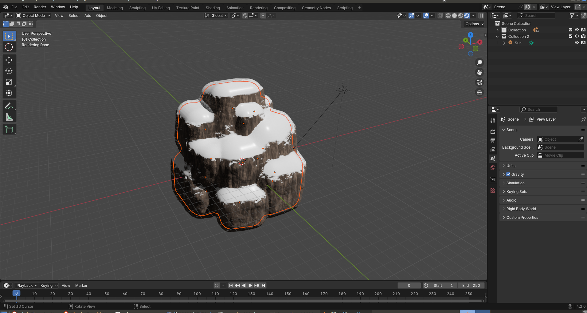
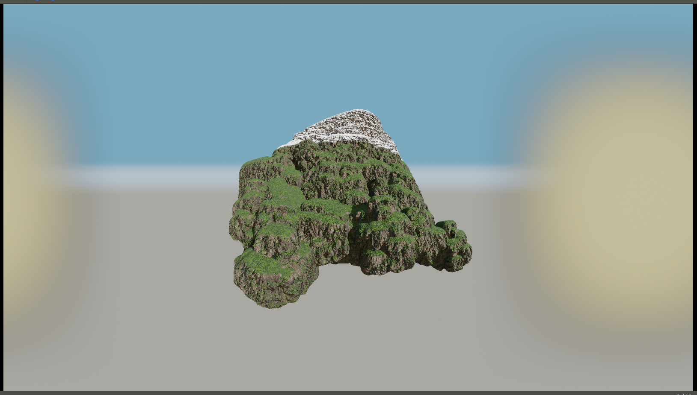

<video src="final 11-3-2024.mp4" controls></video>

First I built the model in a Lego design program. Then exported, cleaned up, rigged and shaded it.

I made a procedural cliff/snow/grass shader, using it for models that make up the mountain.

Modeling passes for the Golden City, along with atmosphere and coloring.

Modeling and shading of the enemy base.
